# Awesome-Parking-Enforcement-Software 🚗⚡

    

 

  

### 🅿️ Curated List of SaaS Platforms, ALPR/ANPR Computer Vision Engines, IoT Sensors & Open-Source Citation Management Software
*Empowering Smart Cities, Municipalities, Universities, Airports, Operators & Developers with Next-Gen Parking Compliance & Enforcement Tools.*

**Last updated: September 2026**

---

## 📖 Overview & Ecosystem Architecture

This repository tracks notable **SaaS/hosted platforms** and **open-source projects** for **Parking Enforcement Software**, **Citation Management**, **Permit Validation**, **Automatic License Plate Recognition (ALPR/ANPR)**, **Curb Management**, and **Parking Compliance**. These systems help municipalities, universities, airports, hospitals, commercial parking operators, and private property managers enforce parking rules, validate permits and payments, issue citations, capture photographic evidence, manage appeals, track collections, and automate license-plate-based enforcement.

**Key Technology Pillars**:
- 📸 **Optical License Plate Recognition (ALPR / ANPR)**: Automated multi-camera vehicle detection and plate recognition.
- 📱 **Mobile Citation Issuance & Evidence Capture**: Real-time officer handheld issuing, GPS stamping, and photographic logging.
- 🌐 **Curb & Zone Management**: Dynamic pricing, IoT sensor telemetry, and digital curb regulations.
- 💳 **Digital Payments & Permit Portals**: Cloud permit validation, pay-by-plate, and automated violation billing.
- 📊 **Spatial Analytics & Dispute Workflows**: GIS heatmap violation patterns, appeal adjudication, and automated collections.

Contributions welcome! Open a PR to add or update entries.

---

## 📑 Table of Contents

* [🏢 SaaS & Hosted Commercial Platforms](#-saashosted-commercial-platforms)
* [💻 Open-Source GitHub Projects](#-open-source-github-projects)
* [🛠️ Additional Strong Open-Source Building Blocks](#️-additional-strong-open-source-building-blocks)
* [📈 Star History](#-star-history)
* [🤝 How to Contribute](#-how-to-contribute)
* [⚠️ Disclaimer & Compliance](#️-disclaimer--compliance)

---

## 🏢 SaaS/Hosted Commercial Platforms

> 💡 **Market Size & Structure**: The global Smart Parking and Enforcement sector is estimated at **$10.9B – $13.7B in 2026** (growing at >18% CAGR); it is a **moderately fragmented market undergoing active consolidation**, where established infrastructure and meter conglomerates (EasyPark/Flowbird, Verra Mobility/T2) acquire AI-native and cloud-born ALPR disruptors.

*(Ranked descending by Company Valuation / Revenue Scale)*

| Platform | Company Valuation / Revenue Scale | Description | Starting Tier Pricing | Free Tier / Trial Limits |
| :--- | :--- | :--- | :--- | :--- |
| **[Genetec AutoVu](https://www.genetec.com/)** | **~$3.0B+ Est. Valuation** (~$600M Annual Revenue) | Enterprise ALPR and unified security platform for high-accuracy vehicle identification, permit validation, and municipal compliance. | **$2,300–$2,500/unit** (AutoVu Cloudrunner CR-H2 camera) + **$65–$120/camera/month** cloud ALPR subscription and Security Center licensing. | **No free-for-ever tier**; 45-day free trial for Genetec Cloud services / Clearance through certified channel partners. |
| **[Flash Parking](https://www.flashparking.com/)** | **$1.0B+ Unicorn Valuation** (~$77M Annual Revenue) | Cloud-born parking access, revenue control system (PARCS), digital LPR enforcement, and business intelligence platform. | **$250–$450/lane/month** under Hardware-as-a-Service (HaaS 36–72 mo term) or **$150/month** cloud software license per location. | **No free tier**; 30-day managed sandbox environment provided upon enterprise qualification. |
| **[T2 Systems](https://www.t2systems.com/)** ([T2 Systems][2]) | **$347M Acquisition Value** by Verra Mobility (~$80M Revenue) | Enterprise parking-management platform supporting mobile enforcement, LPR, citation issuance, permit validation, and appeals. | **$120/officer/month** or **$500/month** base platform subscription + per-citation fees (~$0.15–$0.50/citation) by scale. | **No free tier**; interactive live demo upon request (0-day self-serve trial). |
| **[Flowbird](https://www.flowbird.group/)** | **~$300M+ Valuation** (Acquired by EasyPark; ~$217M Revenue) | Smart parking and curb-management platform providing mobile payments, kiosk terminals, and enforcement integrations. | **Free consumer app** (operator convenience fee starting at **$0.20–$0.35/transaction**; Flowbird Pro starting at **€0.23/session**; kiosk hardware starting at **$7,000–$10,000/terminal** via RFP). | **Free-for-ever consumer app tier** (unlimited parking search and session setup; pay only parking/convenience fees). Operator tier requires scheduled live demo. |
| **[Parkeon / Flowbird Technologies](https://www.flowbird.group/)** | **~$200M+ Scale** (Core hardware division of Flowbird) | Parking technology ecosystem providing multi-space payment terminals, digital services, and enforcement systems. | **$8,000–$12,000/multi-space terminal** + **$35–$65/terminal/month** back-office SaaS management and cellular communications. | **No free tier**; scheduled on-site or virtual proof-of-concept for municipalities (0-day self-serve trial). |
| **[Parkeon Enforcement Ecosystem](https://www.flowbird.group/)** | **~$150M+ Scale** (Flowbird Enforcement Division) | Integrated enforcement hardware and software suite connecting handheld terminals, ANPR vehicles, and municipal back-offices. | **$75/handheld officer license/month** + **$10,000+** per vehicle-mounted ANPR enforcement kit. | **No free tier**; custom pilot deployment arranged for municipal tender evaluations (0-day self-serve trial). |
| **[Passport Parking](https://www.passportinc.com/)** ([Passport][3]) | **~$125M+ Valuation** ($123.5M Total Funding, ~$21M Revenue) | Digital parking and mobility operating system providing digital permits, citation issuance workflows, and LPR integrations. | **$0.15–$0.35/transaction** convenience fee (mobile pay) or starting at **$250/month** base software licensing for citation modules. | **Free-for-ever driver app** (unlimited vehicle registrations & session management); 14-day guided pilot available for municipal teams. |
| **[IPS Group](https://www.ipsgroupinc.com/)** | **~$100M+ Valuation** (~$45M Annual Revenue) | Smart parking technology provider offering connected single-space meters, pay stations, sensors, and enforcement integrations. | **$275–$500/unit** (single-space smart meter) + **$18–$35/meter/month** SaaS data & management fee (Park Smarter back-office). | **Free-for-ever Park Smarter mobile driver app** (unlimited sessions, pay per parking rate); 0-day self-serve operator trial (live demo via RFP). |
| **[ParkMobile](https://parkmobile.io/)** ([ParkMobile][4]) | **~$90M+ Valuation** (Acquired by EasyPark; ~$32M Revenue) | Digital parking platform providing mobile payments, zone management, and enforcement integrations. | **$0.20–$0.65/transaction** (Standard pay-as-you-go) or **$3.99–$5.99/month** (ParkMobile Go zero-fee membership); fleet plans start at **$4.99/vehicle/month**. | **Free-for-ever Basic driver account** (up to 5 saved vehicles, unlimited parking sessions with standard per-session fee); enterprise operator pilot by demo. |
| **[Cale](https://www.cale.se/)** | **~$70M+ Scale** (Flowbird Nordic division) | Parking and mobility technology provider offering Cale WebOffice, solar pay terminals, and mobile enforcement integration. | **$35/terminal/month** (Cale WebOffice SaaS licensing) + hardware deployment costs (~$6,500+/terminal). | **No free tier**; 30-day operator sandbox access granted following vendor consultation. |
| **[CivicSmart](https://civicsmart.com/)** ([CivicSmart][1]) | **~$40M+ Est. Valuation** (~$15M Annual Revenue) | Connected curb-management and smart-parking platform combining meters, sensors, LPR capture, and mobile citation issuance. | **$275/unit** (smart meter head replacement hardware) + **$15–$45/meter/month** (cloud management and wireless telemetry via municipal procurement). | **No free tier**; 30-day pilot/proof-of-concept program available upon municipal qualification. |
| **[Metric Parking](https://www.metricgroup.co.uk/)** | **~$35M+ Scale** (~£18M Annual Revenue) | Parking technology provider delivering pay-and-display terminals, ANPR, permit management, and enforcement infrastructure. | **£4,500–£8,500/terminal** (Universal pay station) + **£25–£50/terminal/month** cloud management and telemetry. | **No free tier**; scheduled operational demonstration upon inquiry (0-day self-serve trial). |
| **[OperationsCommander](https://operationscommander.com/)** ([OperationsCommander][5]) | **~$20M+ Est. Valuation** (~$6M Annual Revenue) | Parking and security operations platform connecting permits, violations, LPR, citation issuance, payments, and appeals. | **$150/month** (Standard starting tier, up to 500 active permits/citations) up to **$1,000/month** (Premium tier for high-volume operations). | **No free-for-ever tier**; 14-day guided sandbox demo trial available for parking administrators. |
| **[Argus Command Center](https://knogin.com/en/developers/parking-citation-management)** ([Knogin][6]) | **~$15M+ Est. Valuation** (~$4M Annual Revenue) | Parking citation-management platform supporting mobile citation issuance, LPR, evidence capture, appeals, and analytics. | **$99/month** (Argus Starter tier, up to 100 citations/month) or **$300/officer device/year** for mobile enforcement issuance. | **No free-for-ever tier**; 30-day free trial (up to 50 test citations and 2 officer mobile accounts). |

---

## 💻 Open-Source GitHub Projects

Open-source building blocks including full-stack parking systems, ANPR/ALPR vision engines, OCR extraction, GIS spatial mappers, workflow orchestrators, IoT telemetry servers, and analytics dashboards.

*(Ranked descending by GitHub Star count)*

| Project | GitHub Stars | Focus / Category | Description |
| :--- | :--- | :--- | :--- |
| **[OpenCV](https://github.com/opencv/opencv)** |  | Computer Vision Core | Major open-source computer-vision framework used for vehicle detection, camera stream processing, parking-space monitoring, evidence capture, and ANPR pipelines. |
| **[PaddleOCR](https://github.com/PaddlePaddle/PaddleOCR)** |  | OCR & ANPR Engine | High-performance multi-lingual OCR framework supporting practical, ultra-lightweight license-plate character recognition and document extraction. |
| **[Grafana](https://github.com/grafana/grafana)** |  | Telemetry & Observability | Industry-standard visualization and dashboard platform for real-time monitoring of ALPR cameras, IoT parking sensors, and municipal enforcement activity. |
| **[Tesseract OCR](https://github.com/tesseract-ocr/tesseract)** |  | Text Extraction / OCR | Mature OCR engine widely used in citation document digitization, scanned evidence processing, and plate number reading. |
| **[Apache Superset](https://github.com/apache/superset)** |  | Business Intelligence | Modern cloud-native data exploration and visualization platform useful for citation heatmaps, violation trends, officer productivity, and revenue analytics. |
| **[Ultralytics YOLO](https://github.com/ultralytics/ultralytics)** |  | Real-time Object Detection | State-of-the-art vision models (YOLOv8/YOLO11) for real-time vehicle bounding, license-plate localization, and parking lot occupancy monitoring. |
| **[Odoo Community](https://github.com/odoo/odoo)** |  | ERP & Operations | Open-source enterprise management framework suitable for building custom permit management, citation billing, customer support, and fleet maintenance modules. |
| **[Metabase](https://github.com/metabase/metabase)** |  | Business Intelligence | Simple, powerful self-hosted analytics engine for generating parking violation statistics, fine collection ratios, and enforcement KPIs. |
| **[Leaflet](https://github.com/Leaflet/Leaflet)** |  | Geospatial Web Maps | Lightweight mobile-friendly mapping library for showing real-time parking zones, officer patrol routes, and citation geotags. |
| **[ToolJet](https://github.com/ToolJet/ToolJet)** |  | Low-Code Admin Panel | Extensible low-code application builder to create internal parking-enforcement dispatch consoles, citation lookup tools, and permit approval portals. |
| **[Appsmith](https://github.com/appsmithorg/appsmith)** |  | Low-Code Internal Tools | Low-code framework for rapidly assembling officer management dashboards, citation review boards, and violation payment admin panels. |
| **[ERPNext](https://github.com/frappe/erpnext)** |  | Financial & Citation Accounting | Robust open-source ERP system that handles violation ledger accounting, fine receivables, citizen billing, and enforcement asset management. |
| **[Keycloak](https://github.com/keycloak/keycloak)** |  | IAM & RBAC Security | Identity and access management platform delivering OAuth2/OIDC, multi-agency SSO, and fine-grained permissions for parking enforcement systems. |
| **[Apache Kafka](https://github.com/apache/kafka)** |  | Event Streaming Broker | High-throughput distributed streaming platform capable of ingesting millions of camera reads, sensor telemetry, and live citation events. |
| **[MMDetection](https://github.com/open-mmlab/mmdetection)** |  | Computer Vision Toolbox | PyTorch-based object detection framework tailored for training custom vehicle, plate, and parking-sign detection models. |
| **[EasyOCR](https://github.com/JaidedAI/EasyOCR)** |  | Deep Learning OCR | Ready-to-use optical character recognition engine with 80+ supported languages, ideal for license plate text reading from mobile enforcement photos. |
| **[Budibase](https://github.com/Budibase/budibase)** |  | Low-Code Workflow Apps | Open-source low-code platform for building custom incident logs, officer shift reports, and citation dispute resolution tools. |
| **[Label Studio](https://github.com/HumanSignal/label-studio)** |  | Data Labeling & AI | Multi-modal data annotation tool for labeling license plates, parking slots, vehicle makes/models, and curb violation footage. |
| **[Darknet (pjreddie)](https://github.com/pjreddie/darknet)** |  | Embedded Object Detection | Original fast neural network framework in C and CUDA, commonly deployed in embedded edge cameras for roadside plate detection. |
| **[Mask R-CNN](https://github.com/matterport/Mask_RCNN)** |  | Instance Segmentation | Instance segmentation model for accurate vehicle boundary extraction, parking space lane marking detection, and obstruction analysis. |
| **[Node-RED](https://github.com/node-red/node-red)** |  | IoT Integration & Flows | Low-code flow-based programming environment connecting ALPR cameras, payment webhooks, thermal printers, and notification microservices. |
| **[Temporal](https://github.com/temporalio/temporal)** |  | Durable Workflow Engine | Resilient workflow orchestrator for long-running enforcement processes including citation escalations, court summons, and payment reminders. |
| **[ThingsBoard](https://github.com/thingsboard/thingsboard)** |  | IoT Device Management | Open-source IoT platform for collecting telemetry from ultrasonic parking sensors, smart meters, and edge ALPR hardware. |
| **[TrOCR (UniLM)](https://github.com/microsoft/unilm/tree/master/trocr)** |  | Transformer OCR | Transformer-based OCR model from Microsoft capable of recognizing distorted or low-resolution plate text and handwritten parking receipts. |
| **[Darknet (AlexeyAB)](https://github.com/AlexeyAB/darknet)** |  | Edge Vision Engine | Highly optimized YOLOv4/YOLOv3 implementation tailored for edge enforcement cameras and low-power Raspberry Pi / Jetson systems. |
| **[PostgreSQL](https://github.com/postgres/postgres)** |  | Core Relational DB | Rock-solid relational database engine for storing citation records, payment histories, audit logs, and cryptographic evidence hashes. |
| **[EMQX](https://github.com/emqx/emqx)** |  | MQTT IoT Broker | Ultra-scalable MQTT broker for connecting tens of thousands of IoT parking meters, sensors, and mobile enforcement devices in real time. |
| **[CVAT](https://github.com/cvat-ai/cvat)** |  | Computer Vision Annotation | Powerful web-based annotation tool for video sequences and parking lot camera feeds to train custom ALPR and parking violation detectors. |
| **[QGIS](https://github.com/qgis/QGIS)** |  | Spatial GIS Desktop | Professional open-source GIS software for mapping parking zones, analyzing violation density heatmaps, and planning enforcement officer beats. |
| **[OpenLayers](https://github.com/openlayers/openlayers)** |  | Dynamic Web GIS | High-performance JavaScript mapping library for rendering municipal parking boundaries, meter clusters, and live patrol vehicle locations. |
| **[OpenALPR](https://github.com/openalpr/openalpr)** |  | Dedicated ALPR/ANPR | Benchmark open-source automatic license plate recognition engine in C++ with bindings for Python, Node.js, and Java. |
| **[doccano](https://github.com/doccano/doccano)** |  | Text Annotation | Open-source text annotation tool for labeling citation appeal letters, legal dispute narratives, and parking ticket metadata. |
| **[Flowable](https://github.com/flowable/flowable-engine)** |  | BPMN Business Workflow | Compact business process management and workflow engine for orchestrating citation review, court scheduling, and dispute escalation. |
| **[Traccar](https://github.com/traccar/traccar)** |  | GPS & Fleet Tracking | Open-source GPS tracking system supporting hundreds of protocols to track enforcement officer vehicles, handhelds, and mobile LPR patrol cars. |
| **[ByteTrack](https://github.com/ifzhang/ByteTrack)** |  | Multi-Object Tracking | High-accuracy association tracker that tracks vehicles entering, dwelling, and exiting parking zones across video frames. |
| **[Deep SORT](https://github.com/nwojke/deep_sort)** |  | Deep Feature Tracking | Simple online and real-time tracking algorithm with deep association metric for persistent vehicle tracking in surveillance cameras. |
| **[Camunda Community](https://github.com/camunda/camunda-bpm-platform)** |  | BPMN Process Platform | Flexible workflow and decision automation platform (BPMN / DMN) ideal for parking violation appeal reviews and fine collection pipelines. |
| **[MMTracking](https://github.com/open-mmlab/mmtracking)** |  | Video Tracking Toolbox | Video perception toolbox providing video object detection and multi-object tracking for automated smart parking camera feeds. |
| **[OpenMapTiles](https://github.com/openmaptiles/openmaptiles)** |  | Vector Tile Infrastructure | Open-source vector tile server for self-hosting custom offline street and parking zone maps for municipal patrol tablets. |
| **[PostGIS](https://github.com/postgis/postgis)** |  | Spatial DB Extension | Spatial extension for PostgreSQL to perform complex geospatial polygon queries (curb regulations, resident parking zones, officer geofencing). |
| **[ChirpStack](https://github.com/chirpstack/chirpstack)** |  | LoRaWAN Network Server | Open-source LoRaWAN network server stack for connecting low-power magnetic parking occupancy sensors across smart city infrastructure. |
| **[ANPR-ATCC](https://github.com/KomatiBhavaniSankar/ANPR-ATCC-Infosys)** ([GitHub][12]) |  | ANPR & Traffic Classification | Automatic number-plate recognition and traffic classification system combining YOLOv10 and Tesseract OCR with SQLite storage and violation whitelists. |
| **[Parking Management Using CV](https://github.com/jangirsamarth/parking-management-system-using-CV)** ([GitHub][9]) |  | Smart Parking App | Computer vision smart parking system combining license plate recognition, entry/exit logging, automated billing, MySQL storage, and Streamlit UI. |
| **[eParking Management System](https://github.com/harytran0407/parking-management-system)** ([GitHub][8]) |  | Full-Stack Parking Suite | ASP.NET Core & React smart parking system featuring ANPR (YOLOv8 + EasyOCR), real-time slot layout, QR payment integrations, and gate controls. |
| **[ParkEasy](https://github.com/khushi-14/ParkEasy)** ([GitHub][11]) |  | Automated ANPR Parking | Automated parking system based on ANPR algorithms for vehicle entry/exit timestamping, duration calculation, and dynamic parking fare estimation. |
| **[ParkX – Next-Gen Smart Parking](https://github.com/ak-junior3339/ParkX-Next-Generation-Smart-Parking-v2)** ([GitHub][10]) |  | FastAPI ANPR System | AI-driven parking management system using YOLOv8 + PaddleOCR for real-time license plate detection and automated check-in/check-out. |
| **[Open Park Project](https://github.com/open-park-project)** ([Open Park Project][7]) |  | Open Parking Architecture | Foundational open-source parking enforcement and fine management platform supporting tickets, controller interfaces, vehicle registry, and zones. |
| **[Open311 GeoReport API](https://github.com/open311/georeport-v2)** |  | Civic Violation Standard | Open standard API for reporting civic issues, illegal parking, and curb violations directly to municipal enforcement dispatchers. |

---

## 🛠️ Additional Strong Open-Source Building Blocks

When assembling a complete self-hosted parking enforcement and citation management architecture, integrate across these core categories:

* 🏗️ **Core Parking Foundations**: Use **Open Park Project**, **eParking Suite**, or custom FastAPI/ASP.NET backends for tenant, zone, and ticket state machines.
* 👁️ **License Plate Recognition (ALPR)**: Deploy **PaddleOCR**, **EasyOCR**, **Tesseract**, or **OpenALPR** paired with **Ultralytics YOLO** or **Darknet** for plate character extraction.
* 🚗 **Vehicle Tracking & Occupancy**: Implement **ByteTrack** or **Deep SORT** on top of **OpenCV** to calculate dwell times and identify overstay violations.
* 🗺️ **GIS & Geofencing**: Store municipal parking zones in **PostgreSQL + PostGIS**, display enforcement beats in **QGIS**, and render interactive web dispatch maps via **Leaflet** or **OpenLayers**.
* 🔄 **Workflow & Dispute Automation**: Automate citation issuance, 30-day notice letters, fine escalation, and appeal adjudication using **Camunda**, **Flowable**, or **Temporal**.
* 📡 **IoT Sensors & Meters**: Ingest real-time ultrasonic and magnetometer parking occupancy data via **EMQX** and **ThingsBoard** or over **ChirpStack LoRaWAN**.
* 📊 **Analytics & Compliance Reporting**: Generate spatial fine collection heatmaps, officer efficiency metrics, and payment conversion funnels using **Apache Superset**, **Metabase**, or **Grafana**.

---

## 📈 Star History

---

## 🤝 How to Contribute

1. 🍴 Fork the repository.
2. ✏️ Add or update entries in `README.md` (ensure adherence to tabular formats, verified starting pricing, and exact free tier / trial parameters).
3. 🔗 Include: name, link, concise 1–2 sentence description, and whether it's SaaS or open-source.
4. 🚀 Submit a Pull Request with a clear summary of changes.

⭐ **Star the repo if you find it helpful!**

---

## ⚠️ Disclaimer & Compliance

* 📜 This is a **community-curated** list — not exhaustive and not an endorsement.
* ⚖️ Parking enforcement software must comply with applicable municipal regulations, privacy laws (e.g., GDPR, CCPA, driver privacy acts), vehicle-data retention standards, and payment processing rules (PCI-DSS).
* 🛡️ License-plate recognition and automated camera enforcement systems can produce false reads and should always maintain human review, evidence verification, and structured appeal mechanisms.
* 🔒 Collection and storage of ALPR images, GPS coordinates, registered owner records, and payment methods require strict access controls, data encryption in transit/at rest, and audit logging.

---

  <b>Made with ❤️ for municipalities, universities, airports, hospitals, parking operators, mobility companies, smart-city teams, enforcement agencies, and developers.</b>

[1]: https://civicsmart.com/?utm_source=chatgpt.com "CivicSmart — The Smart Parking Platform"
[2]: https://www.t2systems.com/parking-enforcement-software/?utm_source=chatgpt.com "Parking Enforcement Software | Mobile & LPR | T2 Systems"
[3]: https://www.passportinc.com/products/integrations?utm_source=chatgpt.com "Integrations - Passport"
[4]: https://parkmobile.io/parking-providers/integrations?utm_source=chatgpt.com "Parking Technology Integrations | ParkMobile"
[5]: https://operationscommander.com/?utm_source=chatgpt.com "Parking and Security Operations Platform | OperationsCommander"
[6]: https://knogin.com/en/developers/parking-citation-management?utm_source=chatgpt.com "Parking Citation Management | Knogin Developers | Argus Command Center"
[7]: https://openparkproject.github.io/OPP-wiki/?utm_source=chatgpt.com "Open Park Project Documentation"
[8]: https://github.com/harytran0407/parking-management-system?utm_source=chatgpt.com "GitHub - harytran0407/parking-management-system: Parking management system with featuring ANPR (YOLOv8 + EasyOCR), real-time slot layout, advance booking, Quick Pay (VietQR/PayOS), and gate control. Built with ASP.NET Core 8/9, React, Python, and MySQL. · GitHub"
[9]: https://github.com/jangirsamarth/parking-management-system-using-CV?utm_source=chatgpt.com "GitHub - jangirsamarth/parking-management-system-using-CV · GitHub"
[10]: https://github.com/ak-junior3339/ParkX-Next-Generation-Smart-Parking-v2?utm_source=chatgpt.com "GitHub - ak-junior3339/ParkX-Next-Generation-Smart-Parking-v2: AI-powered smart parking system using a custom-trained YOLOv8 model + PaddleOCR for real-time license plate detection, recognition, and automated check-in/check-out — built with FastAPI. · GitHub"
[11]: https://github.com/khushi-14/ParkEasy?utm_source=chatgpt.com "GitHub - khushi-14/ParkEasy: ParkEasy is an automated parking system which is based on the ANPR algorithm. · GitHub"
[12]: https://github.com/KomatiBhavaniSankar/ANPR-ATCC-Infosys?utm_source=chatgpt.com "GitHub - KomatiBhavaniSankar/ANPR-ATCC-Infosys: Automatic Number Plate Recognition (ANPR) & Traffic Classification (ATCC) system using YOLOv10 and Tesseract OCR. Real-time vehicle detection, license plate extraction, and data storage in SQLite. Infosys Springboard Project. · GitHub"
